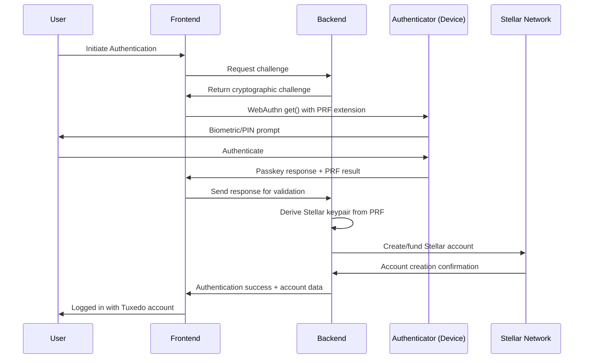
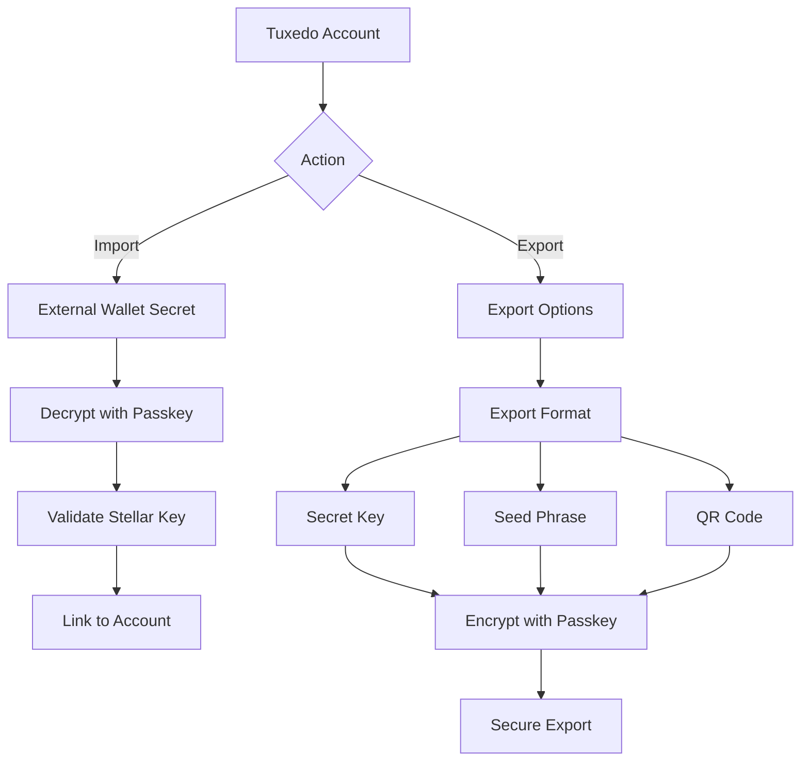

# Passkey Security Architecture for Tuxedo AI

## Executive Summary

This document outlines the research and architectural design for implementing **passkey-based authentication** as the core security system for Tuxedo AI, replacing the current magic link system with enterprise-grade security that bridges both Web2 and Web3 paradigms.

## Current State Analysis

### Existing Authentication System

- **Magic Link Authentication**: Email-based, 15-minute expiry tokens
- **Database Schema**: User accounts with encrypted private keys stored server-side
- **Session Management**: 7-day sessions with HTTP-only cookies
- **Agent Architecture**: AI agents manage their own Stellar accounts autonomously

### Security Limitations

1. **Single Factor**: Only email-based authentication
2. **Server-Side Key Storage**: Encrypted private keys stored in database
3. **No Hardware Security**: No hardware-backed authentication
4. **Limited Crypto Integration**: Poor wallet import/export capabilities

## Research Findings

### WebAuthn/Passkey Standards (2025)

**Current Support Status:**

- **iOS/macOS**: Full support via iCloud Keychain with PRF extension
- **Android**: Robust support across browsers and authenticators
- **Windows**: Limited to external security keys (Windows Hello lacks PRF)
- **Browsers**: Chrome, Safari, Firefox support WebAuthn Level 3

**Key Security Benefits:**

- **Phishing Resistance**: Cryptographic challenge-response authentication
- **Hardware Backing**: Secure Enclave/TPM integration
- **No Passwords**: Eliminates password-based attacks entirely
- **Cross-Device Sync**: Secure synchronization via platform keychains

### Passkey PRF Extension for Crypto

**Revolutionary Capability:**

- **Deterministic Key Derivation**: Private keys derived from passkey authentication
- **Stateless Key Management**: No long-term private key storage required
- **HKDF Integration**: Passkey PRF output used as IKM for cryptographic operations
- **Account Abstraction**: Enables smart contract wallet integration

**Technical Implementation:**

```javascript
// PRF-based private key derivation
const credential = await navigator.credentials.get({
  extensions: {
    prf: {
      eval: {
        first: new Uint8Array([...]) // Application-specific salt
      }
    }
  }
});

// Derive Stellar keypair from passkey PRF
const ikm = credential.getClientExtensionResults().prf.eval.first;
const stellarKeypair = deriveStellarKeypair(ikm);
```

### Web3 Wallet Integration Patterns

**Industry Leaders (2024-2025):**

- **Gemini Wallet**: Passkey-first authentication with seed phrase recovery
- **Crypto.com**: Passkey support for centralized exchange accounts
- **Para**: Embedded wallets with WebAuthn integration
- **Stacks/Polkadot**: Native passkey account derivation via PRF

**Integration Models:**

1. **Passkey-First**: Primary authentication with wallet recovery options
2. **Hybrid Model**: Passkey + traditional wallet support
3. **Account Abstraction**: Passkey as signer for smart contract wallets

## Proposed Security Architecture

### Core Design Principles

1. **Zero Trust Architecture**: No assumption of trust in any single component
2. **Hardware Security**: Leverage device Secure Enclave/TPM capabilities
3. **Stateless Design**: Avoid server-side private key storage where possible
4. **Crypto-Native**: Built for blockchain interaction from the ground up
5. **User Choice**: Multiple recovery and import/export options

### Authentication Flow



### Database Schema Design

```sql
-- User accounts (passkey-first)
CREATE TABLE users (
    id TEXT PRIMARY KEY,
    email TEXT UNIQUE,
    credential_id TEXT UNIQUE NOT NULL,
    public_key TEXT UNIQUE NOT NULL,
    created_at TIMESTAMP DEFAULT CURRENT_TIMESTAMP,
    last_login TIMESTAMP,
    recovery_methods TEXT DEFAULT '["passkey", "seed"]',
    is_active BOOLEAN DEFAULT TRUE
);

-- Passkey credentials
CREATE TABLE passkey_credentials (
    id TEXT PRIMARY KEY,
    user_id TEXT NOT NULL,
    credential_id TEXT UNIQUE NOT NULL,
    public_key TEXT NOT NULL,
    aaguid TEXT,
    sign_count INTEGER DEFAULT 0,
    created_at TIMESTAMP DEFAULT CURRENT_TIMESTAMP,
    last_used TIMESTAMP,
    backup_eligible BOOLEAN,
    backup_state BOOLEAN,
    device_type TEXT,
    transports TEXT,
    FOREIGN KEY (user_id) REFERENCES users (id)
);

-- Derived Stellar accounts
CREATE TABLE stellar_accounts (
    id TEXT PRIMARY KEY,
    user_id TEXT NOT NULL,
    account_id TEXT UNIQUE NOT NULL,
    derivation_salt TEXT NOT NULL,
    network TEXT DEFAULT 'testnet',
    created_at TIMESTAMP DEFAULT CURRENT_TIMESTAMP,
    last_used TIMESTAMP,
    FOREIGN KEY (user_id) REFERENCES users (id)
);

-- Recovery options
CREATE TABLE recovery_options (
    id TEXT PRIMARY KEY,
    user_id TEXT NOT NULL,
    recovery_type TEXT NOT NULL, -- 'seed', 'social', 'cloud'
    recovery_data TEXT, -- Encrypted recovery information
    created_at TIMESTAMP DEFAULT CURRENT_TIMESTAMP,
    FOREIGN KEY (user_id) REFERENCES users (id)
);
```

### Key Management System

#### Primary: Passkey-Derived Keys

- **Authentication**: WebAuthn with PRF extension
- **Key Derivation**: HKDF with passkey PRF as IKM
- **Account Generation**: Deterministic Stellar keypair generation
- **Cross-Device Sync**: Via platform keychain (iCloud/Google Password Manager)

#### Recovery: Multi-Option System

1. **Seed Phrase Recovery**: Traditional 12/24-word mnemonic backup
2. **Social Recovery**: Designated trusted contacts
3. **Cloud Backup**: Encrypted recovery via cloud storage
4. **Hardware Keys**: External security key registration

### Wallet Integration Strategy

#### Two-Tier Architecture

**Tier 1: Tuxedo Native (Primary)**

- Passkey authentication with derived Stellar accounts
- Agent-managed operations in secure TEE environments
- Built-in wallet with advanced features

**Tier 2: External Wallet Adapter (Advanced)**

- Import existing Stellar wallets via secret key
- Export Tuxedo accounts to external wallets
- Integration with Freighter, XBull, Albedo
- Designed for power users and migration scenarios

#### Import/Export Flow



## Implementation Phases

### Phase 1: Core Passkey Authentication

**Timeline**: 2-3 weeks
**Deliverables**:

- WebAuthn registration and authentication endpoints
- Passkey credential management
- Basic Stellar account derivation
- Frontend WebAuthn integration

### Phase 2: Enhanced Security Features

**Timeline**: 2-3 weeks
**Deliverables**:

- PRF extension integration
- Multiple recovery methods
- Session management enhancement
- Security audit and testing

### Phase 3: Wallet Integration

**Timeline**: 2 weeks
**Deliverables**:

- External wallet import functionality
- Account export capabilities
- Stellar Wallets Kit integration
- Migration tools from existing wallets

### Phase 4: Advanced Features

**Timeline**: 1-2 weeks
**Deliverables**:

- Multi-device support
- Account abstraction features
- Advanced recovery options
- Production deployment

## Technical Specifications

### Backend Requirements

```python
# WebAuthn Dependencies
requirements = [
    "webauthn>=2.2.0",           # WebAuthn server implementation
    "pydantic>=2.0.0",           # Data validation
    "cryptography>=41.0.0",      # Cryptographic operations
    "stellar-sdk>=9.0.0",        # Stellar blockchain integration
    "hkdf>=0.0.3",               # Key derivation functions
]

# Core Authentication Endpoints
POST /auth/passkey/register      # Register new passkey
POST /auth/passkey/authenticate  # Authenticate with passkey
GET  /auth/passkey/challenge     # Get authentication challenge
POST /auth/recovery/setup        # Configure recovery options
POST /auth/recovery/restore      # Restore from recovery
```

### Frontend Requirements

```typescript
// WebAuthn Client Libraries
dependencies = {
  "@simplewebauthn/browser": "^9.0.0",
  "@simplewebauthn/typescript-types": "^9.0.0",
  "@stellar/stellar-sdk": "^12.0.0",
  "@creit.tech/stellar-wallets-kit": "^2.0.0",
};

// Core Authentication Functions
class PasskeyAuth {
  async register(email: string): Promise<PasskeyCredential>;
  async authenticate(challenge: string): Promise<AuthenticationResponse>;
  async deriveStellarKey(prfResult: Uint8Array): Promise<Keypair>;
  async setupRecovery(method: RecoveryMethod): Promise<void>;
  async exportAccount(format: ExportFormat): Promise<ExportData>;
}
```

## Security Considerations

### Threat Model

**Protected Against:**

- **Phishing Attacks**: Cryptographic challenge-response prevents credential reuse
- **Password Attacks**: No passwords to brute force or steal
- **Server Breaches**: No usable credentials stored server-side
- **Man-in-the-Middle**: Mutual TLS and origin validation
- **Replay Attacks**: Nonce-based challenges prevent replay

**Remaining Risks:**

- **Device Compromise**: If user device is compromised
- **Social Engineering**: Recovery method manipulation
- **Platform Keychain Issues**: Cloud sync vulnerabilities
- **Physical Access**: Device theft without proper lock screen

### Mitigation Strategies

1. **Multi-Factor Recovery**: Require multiple recovery methods
2. **Rate Limiting**: Prevent brute force on authentication attempts
3. **Device Security**: Enforce device lock screen requirements
4. **Monitoring**: Anomaly detection for authentication patterns
5. **User Education**: Security best practices documentation

## User Experience Design

### Onboarding Flow

1. **Email Registration**: Collect email for account identification
2. **Passkey Creation**: Guided WebAuthn registration
3. **Biometric Setup**: Face ID/fingerprint enrollment
4. **Account Generation**: Automatic Stellar account creation
5. **Recovery Setup**: Configure backup and recovery options
6. **Agent Introduction**: AI agent overview and capabilities

### Authentication Experience

- **Single-Click Login**: Biometric authentication for returning users
- **Cross-Device Sync**: Seamless login across user devices
- **Fallback Options**: Recovery methods when biometrics unavailable
- **Security Indicators**: Clear visual security status indicators

## Compliance and Regulatory

### Data Protection

- **GDPR Compliance**: User data portability and deletion rights
- **Data Minimization**: Only collect necessary authentication data
- **Encryption Standards**: AES-256 for stored data
- **Audit Logging**: Comprehensive security event logging

### Financial Regulations

- **KYC/AML Integration**: Ready for identity verification requirements
- **Travel Rule Compliance**: Transaction monitoring capabilities
- **Securities Considerations**: Suitable for regulated DeFi activities
- **Audit Trails**: Complete transaction and operation history

## Testing Strategy

### Security Testing

- **Penetration Testing**: Third-party security assessment
- **Code Audits**: Smart contract and backend code reviews
- **OWASP Testing**: Web application security testing
- **Cryptographic Validation**: Proper implementation verification

### User Acceptance Testing

- **Usability Studies**: User experience research and feedback
- **Accessibility Testing**: WCAG compliance verification
- **Device Compatibility**: Multi-device, multi-browser testing
- **Performance Testing**: Authentication speed and reliability

## Migration Strategy

### From Magic Link System

1. **Parallel Operation**: Run both systems during transition
2. **Gradual Migration**: Encourage users to migrate to passkeys
3. **Data Preservation**: Maintain existing account data
4. **Decommission Timeline**: 3-month migration window

### From External Wallets

1. **Import Tools**: Easy wallet migration functionality
2. **Educational Content**: Benefits of passkey adoption
3. **Support Channels**: Help users transition
4. **Backward Compatibility**: Limited legacy support during transition

## Success Metrics

### Security Metrics

- **Zero Account Takeovers**: No successful unauthorized access
- **Authentication Speed**: <2 seconds average login time
- **Recovery Success Rate**: >95% successful account recovery
- **Security Incident Rate**: Zero critical security incidents

### User Experience Metrics

- **Adoption Rate**: >80% of users migrate to passkeys
- **User Satisfaction**: >90% satisfaction with authentication
- **Support Tickets**: <5% authentication-related support issues
- **Retention Rate**: >85% user retention after migration

## Conclusion

The passkey security architecture positions Tuxedo AI as a leader in decentralized application security, combining enterprise-grade authentication with blockchain-native functionality. This implementation provides:

- **Bank-Level Security**: Hardware-backed authentication with cryptographic guarantees
- **User-Friendly Experience**: Biometric authentication without complexity
- **Future-Proof Design**: Compatible with emerging Web3 standards and regulations
- **Scalable Foundation**: Ready for production deployment at scale

The architecture supports Tuxedo's mission of democratizing access to decentralized finance while maintaining the security standards necessary for financial applications. The passkey approach bridges the gap between Web2 usability and Web3 security, making cryptocurrency accessible to the next 4 billion users.

---

**Next Steps:**

1. Stakeholder review and approval of architecture
2. Detailed technical specification development
3. Security audit and penetration testing planning
4. Implementation timeline finalization
5. Resource allocation and team assignment

This document serves as the foundation for building a world-class authentication system that will become a competitive advantage for Tuxedo AI in the decentralized finance market.
