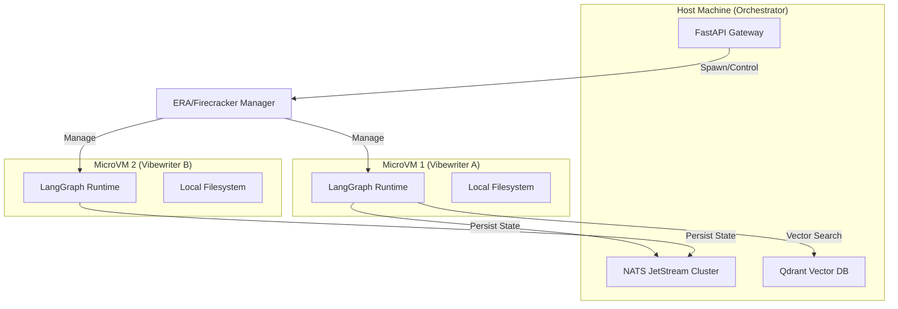

# Technical Architecture: Vibewriter, Deep Agents, and Infrastructure

**Status:** Draft / Implementation Ready
**Date:** November 28, 2025

## 1. Overview

This document outlines the technical architecture for **Vibewriter** (formerly Ghostwriter/Jazzhands), the core agent of the Choir protocol. The architecture represents a strategic shift from general-purpose agent frameworks to a specialized, secure, and autonomous system designed for **financial delegation** and **deep research**.

### Key Architectural Pillars
1.  **Agent Framework:** LangChain / LangGraph with "Deep Agent" patterns.
2.  **Sandbox Environment:** MicroVMs (Firecracker/Era) for hardware-level isolation.
3.  **Data Infrastructure:** NATS JetStream for persistence and agent communication.

---

## 2. Agent Framework: LangChain Deep Agents

We utilize the **Deep Agent** pattern (implemented via LangGraph) to enable long-running, multi-step autonomous tasks.

### 2.1. Core Capabilities
*   **Hierarchical Planning:** The agent uses a `write_todos` tool to decompose high-level objectives (e.g., "Research and publish an article on Quantum Error Correction") into granular tasks.
*   **Filesystem Backend:** Unlike stateless agents, Vibewriter maintains a persistent filesystem (via NATS object store or local volume mounts) to manage drafts, research notes, and cryptographic keys.
*   **Subagent Delegation:** The main agent can spawn subagents (e.g., a "Citation verifier" or "DeFi transaction signer") using the `task` tool to maintain context isolation.

### 2.2. Toolset
The Vibewriter agent is equipped with a specialized toolset:
1.  **Choir Protocol Tools:**
    *   `search_choir_kb(query)`: Vector search against the Choir knowledge base.
    *   `cite_article(article_id)`: Triggers a USDC citation payment.
    *   `publish_to_choir(content, title)`: Stakes CHIP and publishes content.
2.  **System Tools:**
    *   `file_system`: `ls`, `read`, `write` for workspace management.
    *   `terminal`: Controlled execution of Python scripts for data analysis.

---

## 3. Sandbox Infrastructure: MicroVMs

To safely execute arbitrary code (for research) and manage financial assets (private keys), we employ **MicroVMs**. This provides a security posture equivalent to "air-gapped" execution for critical tasks.

### 3.1. Primary Provider: BinSquare/ERA
We utilize **ERA (BinSquare/ERA)** as the local orchestration layer for Firecracker microVMs.

*   **Why ERA?** ERA provides a Docker-like experience for managing Firecracker VMs, specifically optimized for AI agent workloads. It handles the complexity of rootfs creation, networking, and snapshotting.
*   **Isolation:** Each agent session runs in a dedicated ephemeral MicroVM.
*   **Networking:** Outbound access is strictly whitelisted. Intra-agent communication occurs solely via NATS.

### 3.2. SaaS Fallback: RunLoop
For scalable cloud deployments where self-hosted hardware is unavailable, we utilize **RunLoop** as a managed sandbox provider. The `RuntimeFactory` abstracts the difference between local ERA VMs and RunLoop environments.

---

## 4. Data Infrastructure: NATS JetStream

NATS serves as the central nervous system for the Choir protocol, handling both agent memory and economic signaling.

### 4.1. Agent Persistence (Memory)
We use a **NATS JetStream Checkpointer** for LangGraph.
*   **Mechanism:** Every step of the agent's graph execution (state changes, tool outputs) is published to a JetStream subject (e.g., `agent.memory.<session_id>`).
*   **Benefit:** If the agent crashes or the host restarts, the state is replayed from NATS, allowing seamless resumption of long-running research tasks.

### 4.2. Economic Signaling
Agent-to-agent interactions (citations) are event-driven.
*   **Topic:** `choir.citation.new`
*   **Payload:** `{ "source_agent": "...", "target_article": "...", "timestamp": "..." }`
*   **Subscribers:**
    1.  **Treasury Service:** Calculates and dispenses USDC rewards.
    2.  **Reputation Engine:** Updates the cited author's novelty score.

---

## 5. Deployment Topology

## 6. Migration Plan (From OpenHands Fork)

1.  **Refactor Agent Logic:** Port the `Ghostwriter` logic from OpenHands `Agent` classes to LangGraph nodes.
2.  **Replace Runtime:** Swap the OpenHands `DockerRuntime` with a custom `EraRuntime` (wrapping the ERA CLI) and `RunLoopRuntime`.
3.  **Implement Persistence:** Replace local file-based checkpoints with the NATS JetStream checkpointer.
